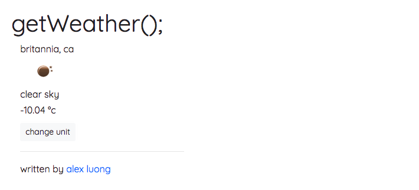

# Local Weather Challenge
Fetches the local weather via an AJAX request to https://fcc-weather-api.glitch.me/api/. Based on a freeCodeCamp [challenge](https://www.freecodecamp.org/challenges/show-the-local-weather).

## Technologies Used
- HTML
- CSS
- Javascript
- jQuery
- Bootstrap 4

## Preview

